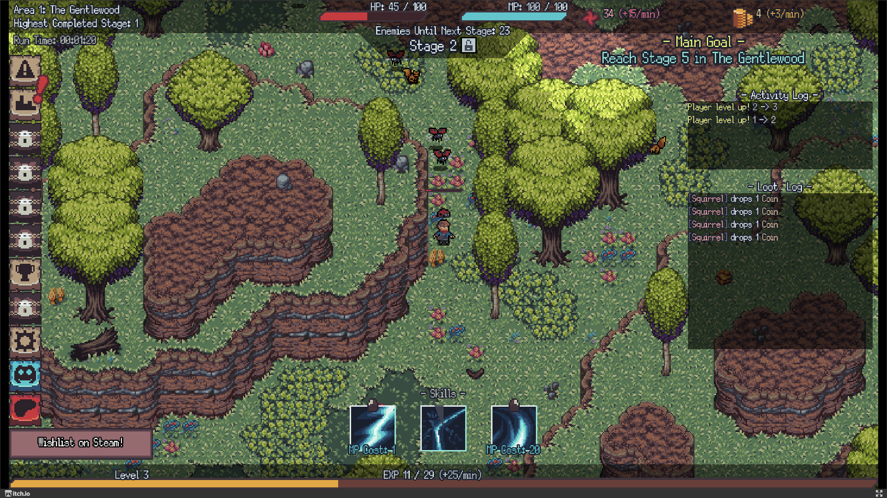

# Draft

**Reference:** [Nomad Idle](https://thefoxknocks.itch.io/nomad-idle)
**Reference Picture:** 
**Platform:** Mobile Vertical

> Inspired by [JRPG](https://www.google.com/search?q=jrpg)

- [[#Overview Gameplay|Overview Gameplay]]
- [[#UI|UI]]
  - [[#UI#Gameplay Screen|Gameplay Screen]]
    - [[#Gameplay Screen#Top Bar|Top Bar]]
    - [[#Gameplay Screen#Under Top Bar|Under Top Bar]]
    - [[#Gameplay Screen#Bottom Panel|Bottom Panel]]
      - [[#Bottom Panel#Party Members Display|Party Members Display]]
        - [[#Party Members Display#Party Member Selection|Party Member Selection]]
      - [[#Bottom Panel#Spell Icons|Spell Icons]]
  - [[#UI#Menus|Menus]]
    - [[#Menus#Character Menus Navigation|Character Menus Navigation]]
      - [[#Character Menus Navigation#Character Menus|Character Menus]]
        - [[#Character Menus#Character Menus Top Pane|Character Menus Top Pane]]
    - [[#Menus#Hamburger Menu|Hamburger Menu]]
    - [[#Menus#Game Mode Menu|Game Mode Menu]]
    - [[#Menus#Achievement Menu|Achievement Menu]]
    - [[#Menus#Character Stats Menu|Character Stats Menu]]
    - [[#Menus#Character Spells Tree|Character Spells Tree]]
    - [[#Menus#Spell Information Menu|Spell Information Menu]]
    - [[#Menus#Character Class Tree|Character Class Tree]]
    - [[#Menus#Settings Menu|Settings Menu]]
  - [[#UI#Leaderboard|Leaderboard]]
- [[#Control|Control]]
  - [[#Control#Movement|Movement]]
  - [[#Control#Options|Options]]
- [[#Power Ups|Power Ups]]
- [[#Character Classes|Character Classes]]
- [[#Game Modes|Game Modes]]
  - [[#Game Modes#Story|Story]]
  - [[#Game Modes#Raid Boss|Raid Boss]]
  - [[#Game Modes#Mini Game|Mini Game]]
  - [[#Game Modes#Offline PvP|Offline PvP]]
- [[#Maps|Maps]]
- [[#Enemies|Enemies]]
  - [[#Enemies#Minions|Minions]]
    - [[#Minions#Humans|Humans]]
    - [[#Minions#Monsters|Monsters]]
    - [[#Minions#Animals|Animals]]
    - [[#Minions#Orcs|Orcs]]
    - [[#Minions#Undeads|Undeads]]
    - [[#Minions#Dragons|Dragons]]
  - [[#Enemies#Bosses|Bosses]]
- [[#Character Stats|Character Stats]]
  - [[#Character Stats#Character Meta Stats|Character Meta Stats]]
  - [[#Character Stats#Character Actual Stats|Character Actual Stats]]
- [[#Limitations|Limitations]]
- [[#Miscellaneous|Miscellaneous]]

## Overview Gameplay

- Characters walk around to attack enemies automatically.
- Each character have their own [[#Character Spells Tree|Spell Tree]] and
  [[#Character Class Tree|Class Tree]].

## UI

### Gameplay Screen

#### Top Bar

- [ ] **Left Side**
  > Display stats

  - [ ] Coin Display
  - [ ] Score Display

- [ ] **Right**
  - [ ] Stage Name
  - [ ] Stage Level

#### Under Top Bar

- [ ] Boss Name
- [ ] Boss Health

#### Bottom Panel

> Shows the party members information.
> [[#Hamburger Menu]] at the top left of the border

##### Party Members Display

> Displays informations related to the party members.
> Each party member can be [[#Party Member Selection|selected]] one at a time.

- [ ] Avatar
- [ ] Name
- [ ] Health
- [ ] Mana
- [ ] Experience

###### Party Member Selection

> Selected party member will have a highlighted border on its display.
> The party member's [[#Spell Icons|Spells]] will be displayed.

##### Spell Icons

> Displays a party member's equipped spells.

- [ ] Image
- [ ] Cooldown display
  - [ ] Radial dark shade
  - [ ] Duration text in seconds

### Menus

#### Character Menus Navigation

> Contains all the character-related menus as tabs
> Facilitates navigation between [[#Character Menus]]

- [ ] **Tab**-based character menus switching

##### Character Menus

- [ ] [[#Character Stats Menu]]
- [ ] [[#Character Spells Tree]]
- [ ] [[#Character Class Tree]]

###### Character Menus Top Pane

> Displays character sprite.
> Change current character with left and right arrow.

#### Hamburger Menu

> Display menu buttons.
> Pops menu **upward** as sidebar.

- [ ] [[#Character Stats Menu]]
- [ ] [[#Character Spells Tree]]
- [ ] [[#Character Class Tree]]
- [ ] [[#Achievement Menu]]
- [ ] [[#Game Mode Menu]]

#### Game Mode Menu

- [ ] Choose [[#Game Modes]] from sidebar tab
- [ ] Each tab contains the game mode's settings

#### Achievement Menu

> Display in-game achievements and their current progress.
> Player can redeem their achievements reward here.

- [ ] **Achievement Types**
  - [ ] Daily
  - [ ] Weekly
  - [ ] All Time

- [ ] **Achievement Display**
  - [ ] Title
  - [ ] Description
  - [ ] Current Progress
    - [ ] **In progress**
      > **Progress text** shown as "\[Current / Target UNIT\]".
      > **Redeem reward button** is not visible.

    - [ ] **Completed**
      > **Progress text** shown as "COMPLETED".
      > **Redeem reward button** is visible and clickable.

    - [ ] **Reward Redeemed**
      > **Progress text** shown as "COMPLETED".
      > **Redeem reward button** is visible, but not clickable.

> [!NOTE] QoL
>
> - [ ] Loading throbber while filtering operation is going on.
> - [ ] Sort achievement by Current Progress
>   Completed -> In Progress -> Reward Redeemed.

#### Character Stats Menu

> Display character stats information
> Part of [[#Character Menus]]

- [ ] [[#Character Stats]]
- [ ] Display stat names
- [ ] Display character stats description
- [ ] Available stat points
- [ ] Increase stat buttons using stat points

#### Character Spells Tree

> Display the character's spell progression as a tree.
> Part of [[#Character Menus]]

- [ ] Available spell points
- [ ] [[#Spell Information Menu]]
- [ ] Learn new spell
- [ ] Upgrade existing spell
- [ ] Equip spells
  - [ ] 3 Skill Slots
    - [ ] 1 auto skill
    - [ ] 2 manual skills
- [ ] Tree view of spell dependency

> [!NOTE] QoL
>
> - [ ] Spell icons shaded dark if cannot be *learned* or *upgraded*

#### Spell Information Menu

- [ ] Status
  - [ ] Not learned
  - [ ] Current Level
- [ ] Description
- [ ] Unlock conditions
  - [ ] Previous spells levels
  - [ ] Character level
- [ ] Number of spell points required to learn
- [ ] Number of spell points required to upgrade to the next level
- [ ] AOE size
- [ ] Stats ratio
- [ ] Active duration
- [ ] Milestone levels
  > Gives extra boost to the skill.
  > Or offer special abilities.

#### Character Class Tree

<!-- TODO: Fill in the information -->

> Display [[#Character Classes]] progression as a tree.
> Part of [[#Character Menus]]

#### Settings Menu

- [ ] **Music Volume Slider**
  > Adjust the volume of the background music

- [ ] **Sound FX Volume Slider**
  > Adjust the volume of sound effects.

- [ ] **Resume Button**
  > Continues the game

- [ ] **Exit Button**
  > Close the game

### Leaderboard

## Control

### Movement

> Tap on the ground to move the party to the location

### Options

- [ ] **Idle** (Toggle)
  - [ ] **ON**
    > The party will move around to attack enemies by themselves.
  - [ ] **OFF**
    > The party will stay still in the same location.

- **Attack while moving** (Toggle)
  - [ ] **ON**
    > The party will attack enemies while moving
  - [ ] **OFF**
    > The party won't attack enemies while moving

## Power Ups

- [ ] **Auto-cast** (Toggle-able on each character individually)
  > Characters will automatically cast spells that would normally
  > require the player to cast manually.

  - [ ] **Hidden cast**
    > Provides extra slots for equipping spells.
    > The spells in these slots will be cast automatically.

## Character Classes

- [ ] [[1733563474-swordsman|Swordsman]]
  - [ ] Paladin
  - [ ] Slayer
- [ ] Mage
  - [ ] Wizard
  - [ ] Cleric
- [ ] Archer
  - [ ] Assassin
    > Single-target damage
  - [ ] Marksman
    > AOE damage
- [ ] Monk
  - [ ] Shaman
    > Utility spells, Status effects, Elemental Power.
    > Magical-based.
  - [ ] Beastmaster
    > Physical-based.
    > Transform into different animals.

## Game Modes

### Story

- [ ] **Settings**
  - [ ] [[#Maps]]
    > Must be unlocked by completing previous maps.

### Raid Boss

- [ ] **Settings**
  - [ ] [[#Maps]]
    > Only unlocked maps from [[#Story|Story Mode]] can be selected

### Mini Game

- [ ] **Settings**
  - [ ] [[#Maps]]
    > Only unlocked maps from [[#Story|Story Mode]] can be selected

### Offline PvP

- [ ] Match against other player with similar power level.
- [ ] 3 choices of players to choose from.
- [ ] The other player's characters is controlled by AI
- [ ] Rewards the winning player with tickets

## Maps

- [ ] Forest
- [ ] Desert
- [ ] Beach
- [ ] Volcano
- [ ] Dungeon (For raid boss)
- [ ] Snowy Region
- [ ] Temple

## Enemies

### Minions

#### Humans

- [ ] Knight
- [ ] Assassin
- [ ] Archer
- [ ] Mage

#### Monsters

- [ ] Slime
- [ ] Stone Golem
  - [ ] Iron Golem
    - [ ] Gold Golem
      - [ ] Diamond Golem

#### Animals

- [ ] Wolfs
  - [ ] Werewolf
- [ ] Bats
  - [ ] Vampire

#### Orcs

- [ ] Goblin
- [ ] Orc Warrior
- [ ] Orc Archer
- [ ] Orc Shaman
- [ ] Giant Orc

#### Undeads

- [ ] Zombie
- [ ] Skeleton
- [ ] Skeleton Warrior
- [ ] Skeleton Archer
- [ ] Necromancer
- [ ] Giant Skeleton
- [ ] Lich

#### Dragons

- [ ] Baby Dragon (with colored varieties)
- [ ] Junior Dragon (with colored varieties)
- [ ] Elder Dragon (with colored varieties)
  > Each colored variety has their own unique ability

### Bosses

- [ ] King Slime
- [ ] King Orc
- [ ] Lucifer
- [ ] King Dragon

## Character Stats

### Character Meta Stats

- [ ] **STR**
  > Strength

- [ ] **DEX**
  > Dexterity

- [ ] **INT**
  > Intelligence

- [ ] **VIT**
  > Vitality

### Character Actual Stats

- [ ] Health
- [ ] Health Regeneration
- [ ] Mana
- [ ] Mana Regeneration
- [ ] Physical Attack
- [ ] Magical Attack
- [ ] Critical Hit Chance
  > Also applies to magic attacks
- [ ] Cooldown Reduction
  > Also doubles as attack speed since regular attacks is considered
  > as a spell with its own cooldown.
- [ ] Physical Defense
- [ ] Magical Defense
- [ ] Status Effect Resistance
- [ ] Status Effect Reduction
- [ ] Evasion

## Limitations

- [ ] **Maximum number of party members:** 3
- [ ] **Maximum level of each character:** 99

## Miscellaneous

- [ ] **Auto-save**
  > The game should be automatically saved.
  
  - [ ] **Conditions**
    - [ ] Every certain time interval
    - [ ] Every in-game purchase
    - [ ] When exiting the game
    - [ ] On important items collected
    - [ ] On level up
    - [ ] On spending spell / stat points
